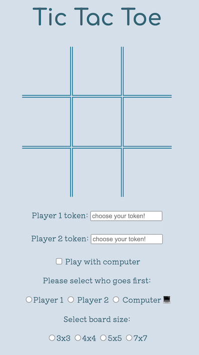
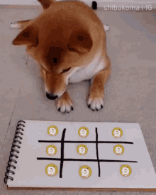

# Tic Tac Toe  

Feeling bored in class/ work/ home, play the classic Tic Tac Toe game instead



Win a game by get a row of 3 tiles either vertically, horizontally or diagonally (for both the 3x3 and 4x4 boards).

For the 5x5 boards it gets trickier where you need 4 in a row and lastly for the ultimate challenge, get 5 in a row on the 7x7 board.


## Motivation

I built this game to practice building a web application from scratch and map out game logic for a simple game.


## Tech/ framework used  

This project uses **HTML, CSS and Javascript**. **JQuery** is also used to communicate with the DOM and interact with elements on the page as the user plays the game.

## Features

* Classic Tic Tac Toe
  * Ability to detect wins and draws
* Custom character tokens (use initials or emojis)
* Custom board sizes (3x3, 4x4, 5x5, 7x7)
* Keeps track of win count  
* Cat dance for wins

In this game of Tic Tac Toe, you can ***choose your characters***, (there's no need for the old boring 'O' and 'X'), maybe you want to be a bear 🐻 or be a poop emoji 💩,(use `cmd` + `ctrl` + `space`) it's all possible! You can also play on ***different board sizes*** for a bigger challenge amongst your friends.

You can also ***choose who gets to start first*** and change these during the many rounds you will play.

## How to use

To play this game, you can download the source code and run it on your browser. Or simply play the game on this link:

https://audreypatricia.github.io/project0/



## Code Example

I thought this was cool! The table appends "creates itself" by appending additional rows and columns when the players chooses a certain board size

```javascript
const createBoard = function(boardSize){
  if(boardSize > 3){

    for(let i = 3; i < boardSize ; i++ ){
      //adds the extra <tr> to table //adding extra rows
      $("table").append("<tr></tr>");
      $($('table tr')[i]).attr('id', 'row' + (i + 1)).attr('class', 'row'); // assigns the id name  and class name

      gameBoard['row' + (i+1)] = [];
    }

    //adding extra columns to each row, depending on how many columns they already have at the moment
    for(let i = 1; i <= boardSize; i++){
      let currentRowColNum = $('#row' + i + ' td').length;

        for(let j = currentRowColNum; j < boardSize; j++) {
          $('#row' + i).append('<td></td>');
          $('#row' + i + ' td:last-child').addClass('col' + j);
        }


      }


    }
  }
```

## Future improvements

* Creating an Computer player that never loses in the classic 3x3 game  
* Allowing for local storage so that points are still kept even when the browser is closed
* Ability to select images/ gifs as player tokens
* Support network players so that this game can be played by someone else not in the same room
